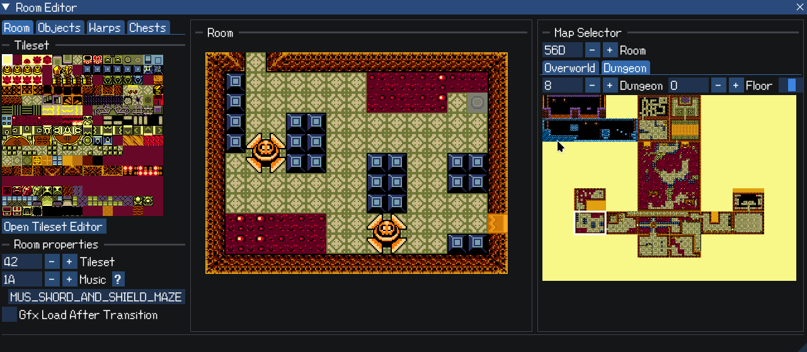
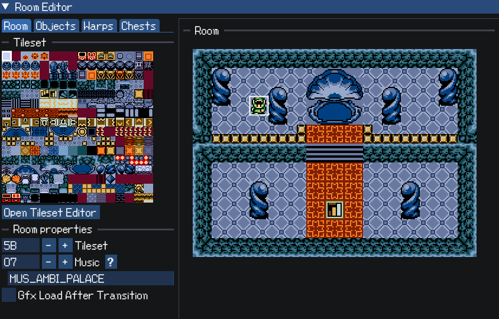
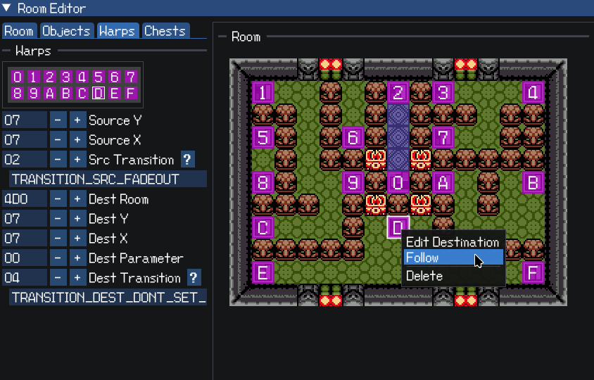

An editor for The Legend of Zelda: Oracle of Ages & Seasons, based on
[oracles-disasm](https://github.com/stewmath/oracles-disasm).

See the [release trailer](https://www.youtube.com/watch?v=u-Sz1d0ZdEk) for a feature overview and
setup instructions!



## Features

### Edit all of the things

Room layouts, object placement, tilesets, dungeons, palettes - all of the
essentials can be edited through LynnaLab.

### Quickstart & Run

Press the quickstart icon to set where Link should spawn in, then click the Run
button to launch your emulator. The game will immediately load into the
specified room.




Note: You must have save data in file slot 1 for this to work, otherwise Weird
Things will happen.

### Object sprite previews

Sourced directly from the game's data files!


### Convenient warp editing interface

Right-click on a warp to follow it to its destination, or interactively edit its
destination.



### ...And much more

LynnaLab is built on top of the
[oracles disassembly](https://github.com/stewmath/oracles-disasm), making the
entirety of the game's codebase available to modify as you please. Custom events
can be created using the game's native scripting language paired with assembly
code.

## Setting it up

### Windows

Either follow the steps in the [release trailer](https://www.youtube.com/watch?v=u-Sz1d0ZdEk&t=126s)
or follow the steps below.

The following steps are necessary to install not only LynnaLab, but also
oracles-disasm and the dependencies necessary to build it.

- Download and install [MSYS2](https://www.msys2.org/) with default settings.
- Download the [latest release](https://github.com/Stewmath/LynnaLab/releases) of LynnaLab.
- Extract the archive.
- Double-click on the "windows-setup.bat" file.
  - This will install some dependencies and download
    [oracles-disasm](https://github.com/stewmath/oracles-disasm) to your MSYS
    folder at `C:\msys64\home\<username>\oracles-disasm.`
- Launch LynnaLab.exe. This should automatically attempt to open oracles-disasm
  which was downloaded during the previous step.
- Configure your emulator path at File -> Choose Emulator Executable to be able
  to run the game.

### Linux

The dependencies on Linux are the .NET Core runtime and GTK3, in addition to the
dependencies for [oracles-disasm](https://github.com/stewmath/oracles-disasm).
You can run LynnaLab with the following command:

```
dotnet LynnaLab.dll
```

You may optionally specify the path to the disassembly and which game to edit:

```
dotnet LynnaLab.dll ~/oracles-disasm seasons
```

## Version numbering scheme (tentative) & oracles-disasm compatibility

LynnaLab modifies oracles-disasm, or more specifically the hack-base branch of
oracles-disasm in most cases. As existing projects cannot grab the latest
changes to the hack-base branch without a git merge operation (whose complexity
depends on the specific changes that have been made), I am experimenting with a
version numbering scheme to help keep track of which LynnaLab versions are
compatible with which hack-base versions.

LynnaLab has a 3-number versioning scheme: X.Y.Z (ie. 2.0.1).

X: The major version. This number will be updated when incompatible changes to
the disassembly's hack-base branch have occurred. Migrating projects between
major versions will require major intervention involving a git merge operation.
So, LynnaLab 1.0.0 projects will not be compatible with 2.0.0+ without manual
intervention.

Y: The minor version. New features may be added in these versions while
remaining compatible with existing projects with the same major version.
Projects may still benefit from updates to the hack-base branch, but this is
optional.

Z: The bugfix version. There shouldn't be any major changes to functionality in
these versions. Obviously there should be no incompatibilities introduced
either.

## Other stuff to know

* Logs are stored in the disassembly folder under the "LynnaLab\\Logs\\"
  subdirectory.

## For more information

- Join our [discord server](https://discord.gg/wCpPPNZ) to meet some cool people
  who are into Zelda Oracles hacking!
- The [Zeldahacking wiki](https://wiki.zeldahacking.net/oracle/LynnaLab) has
  additional information on LynnaLab and Zelda Oracles hacking in general.
